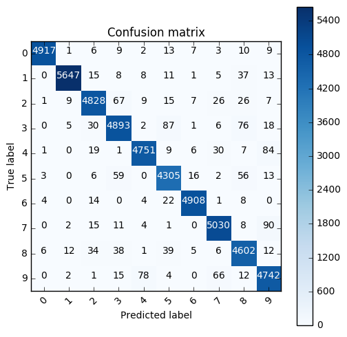
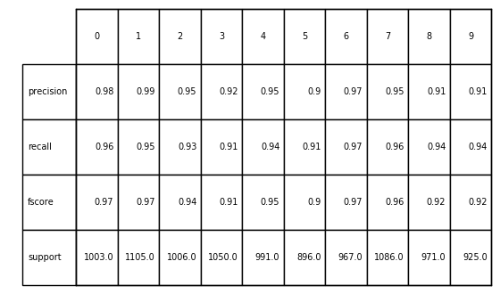
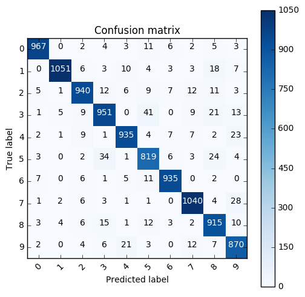
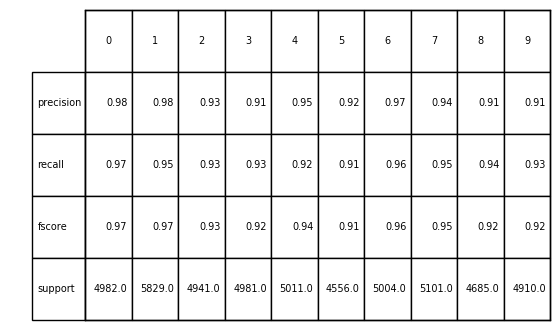
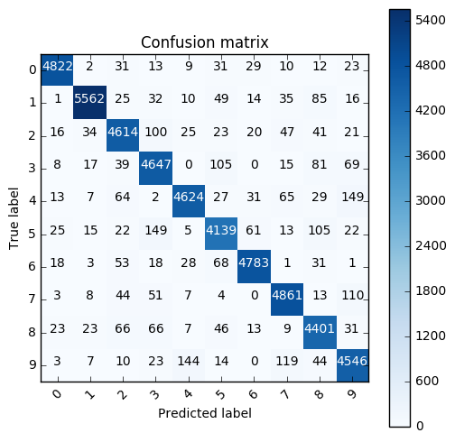
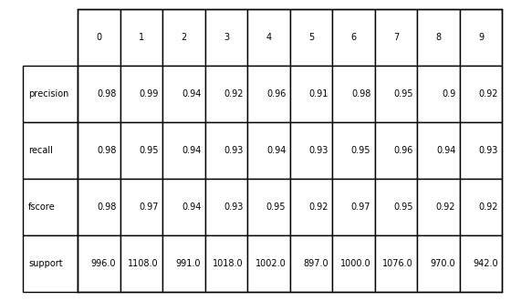
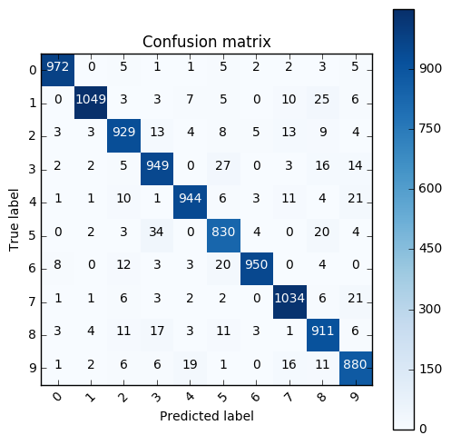

```python
import numpy as np
import cPickle
import gzip
from sklearn import svm
import matplotlib.pyplot as plt
import itertools
from sklearn.metrics import precision_recall_fscore_support
from sklearn.metrics import confusion_matrix
```


```python
def read_mnist(mnist_file):
    """
    Reads MNIST data.
    
    Parameters
    ----------
    mnist_file : string
        The name of the MNIST file (e.g., 'mnist.pkl.gz').
    
    Returns
    -------
    (train_X, train_Y, val_X, val_Y, test_X, test_Y) : tuple
        train_X : numpy array, shape (N=50000, d=784)
            Input vectors of the training set.
        train_Y: numpy array, shape (N=50000)
            Outputs of the training set.
        val_X : numpy array, shape (N=10000, d=784)
            Input vectors of the validation set.
        val_Y: numpy array, shape (N=10000)
            Outputs of the validation set.
        test_X : numpy array, shape (N=10000, d=784)
            Input vectors of the test set.
        test_Y: numpy array, shape (N=10000)
            Outputs of the test set.
    """
    f = gzip.open(mnist_file, 'rb')
    train_data, val_data, test_data = cPickle.load(f)
    f.close()
    
    train_X, train_Y = train_data
    val_X, val_Y = val_data
    test_X, test_Y = test_data    
    
    return train_X, train_Y, val_X, val_Y, test_X, test_Y
```


```python
def plot_confusion_matrix(cm, classes,
                          normalize=False,
                          title='Confusion matrix',
                          cmap=plt.cm.Blues):
    """
    This function prints and plots the confusion matrix.
    Normalization can be applied by setting `normalize=True`.
    """
    plt.imshow(cm, interpolation='nearest', cmap=cmap)
    plt.title(title)
    plt.colorbar()
    tick_marks = np.arange(len(classes))
    plt.xticks(tick_marks, classes, rotation=45)
    plt.yticks(tick_marks, classes)

    if normalize:
        cm = cm.astype('float') / cm.sum(axis=1)[:, np.newaxis]
        print("Normalized confusion matrix")
    else:
        print('Confusion matrix, without normalization')

    #print(cm)

    thresh = cm.max() / 2.
    for i, j in itertools.product(range(cm.shape[0]), range(cm.shape[1])):
        plt.text(j, i, cm[i, j],
                 horizontalalignment="center",
                 color="white" if cm[i, j] > thresh else "black")

    plt.tight_layout()
    plt.ylabel('True label')
    plt.xlabel('Predicted label')
```

## Đọc dữ liệu từ MNIST


```python
# Test
train_X, train_Y, val_X, val_Y, test_X, test_Y = read_mnist('mnist.pkl.gz')

print 'train_X.shape =', train_X.shape
print 'train_Y.shape =', train_Y.shape
print 'val_X.shape   =', val_X.shape
print 'val_Y.shape   =', val_Y.shape
print 'test_X.shape  =', test_X.shape
print 'test_Y.shape  =', test_Y.shape

print '\ntrain_X: min = %.3f, max = %.3f' %(train_X.min(), train_X.max())
print 'train_Y: min = %d, max = %d' %(train_Y.min(), train_Y.max())
```

    train_X.shape = (50000L, 784L)
    train_Y.shape = (50000L,)
    val_X.shape   = (10000L, 784L)
    val_Y.shape   = (10000L,)
    test_X.shape  = (10000L, 784L)
    test_Y.shape  = (10000L,)
    
    train_X: min = 0.000, max = 0.996
    train_Y: min = 0, max = 9
    

## 1. Huấn luyện SVM không dùng kernel
Với các tham số như sau:
+ Phân 10 lớp bằng cách “one-against-one”
+ Sử dụng kernel là linear
+ Tham số C = 1.0


```python
clf = svm.SVC(decision_function_shape='ovo',kernel='linear')
clf.fit(train_X, train_Y)
```


    SVC(C=1.0, cache_size=200, class_weight=None, coef0=0.0,
      decision_function_shape='ovo', degree=3, gamma='auto', kernel='linear',
      max_iter=-1, probability=False, random_state=None, shrinking=True,
      tol=0.001, verbose=False)


## Đánh giá trên bộ dữ liệu train $E_{in}$


```python
predict_train = clf.predict(train_X)
result_train = confusion_matrix(predict_train,train_Y)
```

    Evaluation: 
    (array([ 0.99695864,  0.99454033,  0.97181965,  0.95922368,  0.9777732 ,
            0.95539281,  0.99131489,  0.97198068,  0.95043371,  0.95068164]), array([ 0.98794454,  0.98294169,  0.96656657,  0.95603751,  0.96801141,
            0.96524664,  0.98931667,  0.97461732,  0.96782334,  0.96382114]), array([ 0.99243112,  0.98870699,  0.96918599,  0.95762795,  0.97286782,
            0.96029445,  0.99031477,  0.97329721,  0.9590497 ,  0.9572063 ]), array([4977, 5745, 4995, 5118, 4908, 4460, 4961, 5161, 4755, 4920], dtype=int64))
    

### Kết quả

Precision, recall và fscore


```python
plt.figure()
the_table = plt.table(cellText=np.round(precision_recall_fscore_support(predict_train,train_Y),2),
                      rowLabels=["precision","recall","fscore","support"],
                      colLabels=range(10),
                     bbox=[0,0,1,1])

ax = plt.gca()
ax.set_xticks([])
ax.set_yticks([])
plt.show()
```


Confusion Matrix


```python
plt.figure(figsize=(5,5))
plot_confusion_matrix(result_train,range(10),normalize=False)
plt.show()
```

    Confusion matrix, without normalization
    





## Đánh giá trên bộ dữ liệu validation $E_{val}$


```python
predict_val = clf.predict(val_X)
result_val = confusion_matrix(predict_val,val_Y)
```

    Evaluation: 
    (array([ 0.97578204,  0.98778195,  0.94949495,  0.92330097,  0.95116989,
            0.89508197,  0.96690796,  0.95412844,  0.90683845,  0.90530697]), array([ 0.96410768,  0.95113122,  0.93439364,  0.90571429,  0.94349142,
            0.9140625 ,  0.96690796,  0.95764273,  0.9423275 ,  0.94054054]), array([ 0.96990973,  0.96911019,  0.94188377,  0.91442308,  0.9473151 ,
            0.90447267,  0.96690796,  0.95588235,  0.92424242,  0.92258749]), array([1003, 1105, 1006, 1050,  991,  896,  967, 1086,  971,  925], dtype=int64))
    

### Kết quả

Precision, recall và fscore


```python
plt.figure()
the_table = plt.table(cellText=np.round(precision_recall_fscore_support(predict_val,val_Y),2),
                      rowLabels=["precision","recall","fscore","support"],
                      colLabels=range(10),
                     bbox=[0,0,1,1])
ax = plt.gca()
ax.set_xticks([])
ax.set_yticks([])
plt.show()
```





Confusion matrix


```python
plt.figure(figsize=(5,5))
plot_confusion_matrix(result_val,range(10),normalize=False)
plt.show()
```

    Confusion matrix, without normalization
    





## 2. Huấn luyện SVM dùng RBF kernel
Với các tham số như sau:
+ Phân 10 lớp bằng cách “one-against-one”
+ Sử dụng kernel là RBF
+ Tham số C = 1.0


```python
rbf_svc = svm.SVC(decision_function_shape='ovo',kernel='rbf')
rbf_svc.fit(train_X, train_Y)
```


    SVC(C=1.0, cache_size=200, class_weight=None, coef0=0.0,
      decision_function_shape='ovo', degree=3, gamma='auto', kernel='rbf',
      max_iter=-1, probability=False, random_state=None, shrinking=True,
      tol=0.001, verbose=False)


```python
predict_train_rbf = rbf_svc.predict(train_X)
result_train_rbf = confusion_matrix(predict_train_rbf,train_Y)
```


```python
plt.figure()
the_table = plt.table(cellText=np.round(precision_recall_fscore_support(predict_train_rbf,train_Y),2),
                      rowLabels=["precision","recall","fscore","support"],
                      colLabels=range(10),
                     bbox=[0,0,1,1])

ax = plt.gca()
ax.set_xticks([])
ax.set_yticks([])
plt.show()
```





```python
plt.figure(figsize=(5,5))
plot_confusion_matrix(result_train_rbf,range(10),normalize=False)
plt.show()
```

    Confusion matrix, without normalization
    





```python
predict_val_rbf = rbf_svc.predict(val_X)
result_val_rbf = confusion_matrix(predict_val_rbf,val_Y)
```


```python
plt.figure()
the_table = plt.table(cellText=np.round(precision_recall_fscore_support(predict_val_rbf,val_Y),2),
                      rowLabels=["precision","recall","fscore","support"],
                      colLabels=range(10),
                     bbox=[0,0,1,1])
ax = plt.gca()
ax.set_xticks([])
ax.set_yticks([])
plt.show()
```





```python
plt.figure(figsize=(5,5))
plot_confusion_matrix(result_val_rbf,range(10),normalize=False)
plt.show()
```

    Confusion matrix, without normalization
    





```python

```
